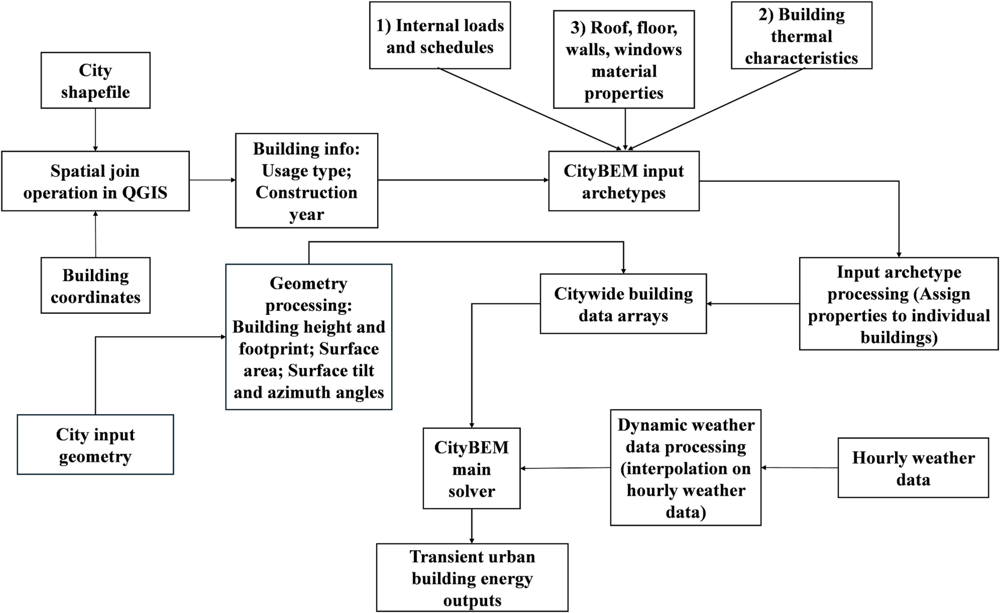

# CityBEM: From Inputs to City Energy Results

## 1. Workflow Overview

The **figure below** presents the overall CityBEM V2 workflow, illustrating how diverse geospatial, archetype, and material datasets are integrated and processed into unified **citywide building data arrays**.

<figure markdown>
  { width="100%" }
  <figcaption>CityBEM integrates GIS, archetypes, and 3D geometry into unified data arrays.</figcaption>
</figure>

This workflow captures the full input-management pipeline in CityBEM — from GIS preprocessing and archetype assignment to geometry extraction and simulation-ready data generation.

### 1.1 Geospatial Matching (QGIS)
!!! info ""
    🗺️ Integrates GIS building footprints with attributes such as height, land-use, construction year, and parcel data.

### 1.2 Archetype Assignment
!!! info ""
    🏢 Assigns thermal, material, occupancy, and HVAC characteristics to each building through archetype mapping.

### 1.3 3D Geometry Processing
!!! info ""
    📐 Computes surface geometry (area, tilt, azimuth, façade grouping, roof type) required for thermal and solar modeling.

### 1.4 Weather Data Preparation
!!! info ""
    🌦️ Converts hourly meteorological data to the simulation time step and prepares dynamic boundary conditions.

### 1.5 Citywide Building Data Arrays
!!! info ""
    🧩 Builds optimized internal arrays for storing building attributes and driving the transient heat/mass balance solver.

Together, these components form a cohesive workflow enabling CityBEM V2 to perform **large-scale, high-resolution UBEM simulations** with both computational efficiency and physical fidelity.

---

## 2. :material-database-import: Input Data Specification

CityBEM V2 operates using a structured collection of input files that define the full configuration of a city-scale building energy simulation.  
These files specify the **building inventory**, **archetype definitions**, **material and thermal properties**, **meteorological conditions**, and **simulation control parameters** required by the framework.

All input files must follow a consistent formatting standard to ensure reliable parsing and reproducibility:

- Mostly text format (`.txt`)
- Tab-separated values (recommended for clarity and compatibility)
- UTF-8 encoding
- A single header row followed by data records

This page provides a detailed description of each required input file, including its purpose, data structure, parameter definitions, and the consistency constraints enforced throughout the CityBEM workflow.

---

## 3. :material-cube-outline: Building Geometry Input

### 3.1 ASCII STL Geometry  

`Input_City_scale_geometry_CityBEM.stl`

<figure markdown>
  { width="100%" loading=lazy }
  <figcaption>3D urban building geometry using SCII STL files</figcaption>
</figure>

---

### 3.2 Purpose

The geometry file defines the **3D building representation** for the UBEM domain in **ASCII STL** format.  
Each building must be stored as an individual `solid` block to ensure clean building separation and accurate surface reconstruction.

---

### 3.3 Coordinate system

CityBEM uses a well-defined right-handed coordinate system:

- **X-axis → East**  
- **Y-axis → Upwards (vertical)**  
- **Z-axis → North**

This convention must be followed when:

- Importing building models from external platforms  
- Aligning CityBEM with **CFD models**, **microclimate solvers**, or **GIS datasets**  
- Interpreting solar geometry (azimuth, altitude, incidence angles)

Maintaining consistent coordinates ensures that solar, shading, and thermal calculations operate correctly.

---

### 3.4 STL Structure

- Each building is represented as a `solid` block.  
- Inside each block, **triangular facets** define the building surfaces.  
- CityBEM performs a **triangle-grouping process** to reconstruct planar surfaces (walls, roofs, floor slabs).  
- Degenerate or non-planar triangles are automatically handled during preprocessing.

This structure enables robust geometry interpretation for large building stocks.

---

### 3.5 Preprocessing Workflow

CityBEM includes a geometry-preprocessing tool that can:

- Convert STL/OBJ models into the **CityBEM coordinate system**  
- Assign consistent `building_id` tags  
- Filter and remove non-building objects (terrain, vegetation, urban furniture)  
- Validate and repair geometry to ensure watertight surfaces  
- Prepare surface metadata required for solar and thermal simulation

This geometry file is foundational for:

- Computing envelope areas, surface normals, and orientations  
- Running roof/ façade solar radiation calculations  
- Performing **inter-building shading analysis**  
- Coupling with CFD/microclimate tools (CityFFD, OpenFOAM, etc.)

---

### :material-toolbox-outline: 3.6 Useful Tools

Below are recommended platforms to help users **generate, edit, or validate** building geometry before importing into CityBEM.  

---

#### :material-map-outline: Interactive GIS & OSM Tools

!!! info "GeoJSON.io — Quick Editing & Export"
    An intuitive web tool for drawing or editing footprints and exporting them as **GeoJSON**, which can then be extruded into 3D.  
    <a href="https://geojson.io/#map=5/44.19/-74.91" target="_blank">Open GeoJSON.io</a>

!!! info "OpenStreetMap — Building Footprints & Metadata"
    Useful for downloading building footprints, heights, and land-use attributes. Ideal for city-scale UBEM initialization.  
    <a href="https://www.openstreetmap.org/#map=13/45.47040/-73.64460" target="_blank">Open OpenStreetMap</a>

!!! info "OSM2World — Convert OSM to 3D Geometry"
    Generates **3D models** from OSM footprints (walls, roofs, extrusions), exportable to OBJ/STL for CityBEM preprocessing.  
    <a href="https://www.osm2world.org/" target="_blank">Open OSM2World</a>

---

#### :material-cube-scan: 3D Processing & Validation Tools

!!! info "ParaView — Geometry Inspection & Surface Analysis"
    Excellent for visualizing STL files, checking mesh quality, inspecting normals, and validating triangle structure before CityBEM import.  
    <a href="https://www.paraview.org/" target="_blank">Open ParaView</a>

!!! info "MeshLab — Mesh Repair & Optimization"
    Ideal for cleaning, repairing, reducing, or reorienting STL/OBJ meshes. Useful when importing geometry exported from BIM/GIS tools.  
    <a href="https://www.meshlab.net/" target="_blank">Open MeshLab</a>

---

# 1. Building Stock Data

## 1.1 `Input_City_scale_building_info.txt`

  

### Purpose

This file defines the **core metadata** for every building in the simulation domain. It acts as the **central index** that links:
- GIS/OSM geometry
- Archetype assignments (by year and usage type)
- Geospatial location for solar and weather processing

Each row corresponds to **one building**.

### Typical Columns and Their Roles

| Column | Description |
|--------|-------------|
| `building_id` | Unique internal ID used by CityBEM (integer or string). This ID must be consistent across all input and output files referencing buildings. |
| `building_osm_id` | External GIS or OpenStreetMap identifier used for traceability and GIS post-processing. |
| `year_of_construction` | Construction year or representative vintage. Used to map the building to a **construction-year archetype** (thermal envelope properties, infiltration, etc.). |
| `usage_type_code` | Code that links the building to a **usage-type archetype** (occupancy, internal loads, schedules, HVAC). Must match IDs defined in `Input_City_scale_archetype_usage_type.txt`. |
| `longitude`, `latitude` | Geographic coordinates (WGS84). Used for solar position and potential external GIS operations. |

Depending on the case, additional columns can be included (e.g., number of floors, floor area), but the **minimum set** must at least allow:
- Unambiguous building identification
- Mapping to year and usage archetypes
- Providing a location in space (for solar and microclimate coupling)

### How CityBEM Uses This File

- Reads all building rows and constructs an internal **building list/array**.
- For each building:
  - Uses `year_of_construction` to select envelope properties from the **year archetype** file.
  - Uses `usage_type_code` to select operational and HVAC properties from the **usage-type archetype** file.
  - Links the `building_id` to geometric entities in the STL file based on the same ID or consistent naming.

**Consistency requirement:**  
All buildings referenced in other files (e.g., result selection, PV configuration, etc.) must use the same `building_id` defined here.

---

# 2. Archetype Libraries

Archetypes define **typical properties** for groups of buildings, instead of specifying every parameter per building. CityBEM V2 uses archetypes to keep simulations scalable at the **city level**.

The following files define different archetype dimensions:

- Construction year (envelope, infiltration)
- Usage type (internal loads, schedules, HVAC)
- Material composition (slabs, walls, construction materials)
- Energy sources (for operational GHG calculations)
- Internal heat gains

---

## 2.1 Construction Year Archetype  
### `Input_City_scale_archetype_year.txt`

  

### Purpose

This file defines **construction-year-based archetypes**, which capture how building envelopes and infiltration rates differ across vintages (e.g., pre-1945, 1945–1975, post-2000).

Each row corresponds to a **construction year class**, usually represented by:
- A year interval (e.g., 1945–1975) or
- A representative year (e.g., 1975)

### Main Data Blocks

1. **Infiltration (ACH)**  
   - Typical air change rates (ACH) for:
     - Winter conditions
     - Summer conditions
   - These values are used to estimate **air leakage** and its impact on heating/cooling loads.
   - ACH values are later converted to mass/volumetric flow rates based on floor area and ceiling height.

2. **Envelope Properties**  
   For each year archetype, the file includes parameters such as:

   - **U-values** (W/m²·K) for:
     - Roof
     - External walls
     - Ground floor/slab
     - Windows
   - **Solar Heat Gain Coefficient (SHGC)** for glazing  
   - **Material properties** (effective values for simplified envelope layers):
     - Heat capacity (Cp, J/kg·K)
     - Density (ρ, kg/m³)
     - Effective layer thickness (m)
   - **Radiative properties**:
     - Shortwave absorptance (α) for walls and roofs
     - Longwave emissivity (ε)

These parameters directly influence:
- Heat transfer through the envelope
- Solar absorption on opaque surfaces
- Thermal mass effects during transient simulations

### How CityBEM Uses This File

- For each building, the `year_of_construction` from `Input_City_scale_building_info.txt` is mapped to a **year archetype row**.
- The envelope and infiltration values are assigned to all surfaces and zones of that building.
- These properties are used in:
  - Surface heat balance equations
  - Zone energy balance
  - Calculation of heating/cooling demand

---

## 2.2 Usage-Type Archetype  
### `Input_City_scale_archetype_usage_type.txt`

  

### Purpose

This file defines **operational and internal-load characteristics** for each building usage type, such as:
- Residential
- Office
- Retail
- Educational
- Healthcare
- Etc.

Each row corresponds to a **usage-type archetype** referenced by `usage_type_code` in `Input_City_scale_building_info.txt`.

### Key Parameters and Their Roles

Typical columns include:

- **Geometric/structural parameters**
  - Floor range (minimum and maximum number of floors where this usage type applies)
  - Floor height `Hf` (m), used to compute zone volume and number of thermal zones

- **Occupancy and schedules**
  - Occupancy schedule ID (linking to schedule definitions used for internal gains)
  - Maximum occupancy density (person/m²)
  - Sensible and latent heat gains per person (W/person)
  - Activity levels may be defined or referenced elsewhere, depending on implementation

- **HVAC parameters**
  - Heating and cooling setpoint temperatures for:
    - Occupied periods
    - Unoccupied periods (setback/set-up)
  - HVAC system type or operation mode (e.g., heating-only, cooling-only, full HVAC)
  - HVAC efficiencies:
    - Seasonal performance factor (SPF) for heat pumps
    - Coefficient of performance (COP) for chillers or cooling systems

- **Envelope-related operational parameters**
  - Window-to-wall ratio (WWR) for typical façade design per usage type
  - Heated floor area ratio (fraction of building floor area that is conditioned/heated)

### How CityBEM Uses This File

- For each building, CityBEM:
  - Reads its `usage_type_code`
  - Assigns the corresponding internal loads, schedules, HVAC setpoints, and system efficiencies
- These archetypes determine:
  - Internal gains (occupants, lighting, appliances) as a function of time
  - The target indoor temperature for the HVAC control
  - Whether a zone is actively heated/cooled or allowed to float

This file is central to **operational behavior** and has a strong influence on:
- Annual energy demand
- Peak loads
- Comfort-related variables (indoor temperature, humidity)

---

## 2.3 Slab Material Archetype  
### `Input_City_scale_archetype_slabs_material.txt`

  

### Purpose

This file defines **simplified multi-layer slab constructions** (e.g., floor slabs, intermediate slabs) used to represent the thermal mass of horizontal building elements.

Each row represents a **slab type**, which may be linked to specific usage types or construction-year categories depending on your workflow.

### Typical Parameters

- Total slab thickness (m)
- Layer sequence and thicknesses (e.g.):
  - Concrete
  - Insulation
  - Gypsum board
  - Wood floor
- Optional effective thermal properties if present:
  - Conductivity (W/m·K)
  - Volumetric heat capacity (J/m³·K)

### How CityBEM Uses This File

- Converts layer definitions into:
  - Overall thermal resistance / capacitance
  - Equivalent thermal mass representation
- Applies slab properties in:
  - Heat balance equations for floor surfaces
  - Transient storage of energy in the building mass

---

## 2.4 External Wall Material Archetype  
### `Input_City_scale_archetype_external_wall_material.txt`

  

### Purpose

This file defines **simplified external wall constructions** for typical wall types used in the building stock.

Each row corresponds to a **wall material configuration**, which may be associated with specific year/usage archetypes.

### Typical Parameters

- Number of layers and their material type (e.g., brick, insulation, concrete, sheathing)
- Thickness of each layer (m)
- Optional effective properties (if not provided in the year archetype):
  - Thermal conductivity (W/m·K)
  - Density (kg/m³)
  - Specific heat (J/kg·K)

### How CityBEM Uses This File

- Builds an equivalent 1D conduction model for wall elements.
- Evaluates:
  - Transient heat conduction through walls
  - Thermal mass buffering effects
- Works in combination with the **year archetype** file:
  - The year archetype provides effective U-values and high-level properties.
  - This material file refines the internal representation if detailed mass modeling is required.

---

## 2.5 Internal Heat Gains (IHG)  
### `Input_City_scale_archetype_IHG.txt`

  

### Purpose

This file specifies **detailed internal heat gain profiles** for each usage type or sub-case (e.g., residential weekday vs. weekend, office, school, etc.).

Each row usually represents an **IHG case** that can be linked to a usage-type archetype.

### Typical Parameters

- **Occupancy-related**
  - Occupancy schedules (fraction of peak occupancy over time)
  - Sensible heat gain per person (W/person)
  - Latent heat gain per person (W/person)

- **Appliances and plug loads**
  - Equipment schedules (fraction of maximum load)
  - Maximum equipment power density (W/m²)

- **Lighting**
  - Lighting schedules
  - Lighting power density (W/m²)
  - Radiative vs. convective fraction of lighting gains (if considered)

### How CityBEM Uses This File

- Reads schedule IDs and mapping definitions to generate **time-varying internal loads**.
- At each simulation timestep, the framework:
  - Evaluates occupancy, lighting, and appliance loads
  - Splits them into sensible and latent components (if modeled)
  - Injects them into the zone energy and moisture balance

This file is essential for capturing **daily and seasonal patterns** of internal gains.

---

## 2.6 Energy Sources & Emission Factors  
### `Input_City_scale_archetype_energy_source.txt`

  

### Purpose

This file describes how **energy carriers** (e.g., electricity, natural gas, district heating) are used in the model and assigns **GHG emission factors** to them.

### Typical Parameters

- Number of energy carriers defined
- For each energy carrier:
  - Name (e.g., `Electricity`, `NaturalGas`, `DistrictHeat`)
  - Emission factor (e.g., gCO₂e/kWh, kgCO₂e/kWh)
  - Possibly primary energy factor (if implemented)
  - Mapping to specific **end uses**, such as:
    - Space heating
    - Space cooling
    - Fans and pumps
    - Lighting
    - Appliances and plug loads

### How CityBEM Uses This File

- After computing energy demand and HVAC consumption, CityBEM assigns each end-use energy flow to an energy carrier.
- The corresponding **emission factors** are applied to compute:
  - Time-resolved GHG emissions
  - Aggregated annual GHG emission metrics

This enables comparison of retrofitting scenarios not only in terms of energy, but also in terms of **carbon footprint**.

---

## 2.7 Construction Materials (Embodied Emissions)  
### `Input_City_scale_archetype_construction_materials_general.txt`

  

### Purpose

This file provides **general material properties** used to compute **embodied emissions** for the building stock.

Each row represents a **material type** commonly used in regional construction (e.g., Montreal).

### Typical Parameters

- Material name (e.g., `Concrete`, `Brick`, `MineralWool`, `GypsumBoard`)
- Density (kg/m³)
- Embodied emission factor for life cycle stages A1–A3 (e.g., kgCO₂e/m³ or kgCO₂e/kg)

### How CityBEM Uses This File

- Combined with envelope and material layer definitions (thickness, area), CityBEM can:
  - Estimate **material quantities** at the building scale
  - Compute total **embodied GHG emissions** (GHG-EE)
  - Compare embodied emissions across retrofitting scenarios

---

## 4. :material-weather-cloudy: Weather Data

### **`Input_weatherdata.txt`**

<figure markdown>
  { width="100%" loading=lazy }
  <figcaption>CityBEM hourly weather data format (EPW-derived)</figcaption>
</figure>

---

### 📘 4.1 Overview

`Input_weatherdata.txt` provides the meteorological time series that CityBEM uses as boundary conditions for all buildings in the simulation domain.

This file typically contains **one full year** of data at a fixed time interval (e.g., hourly or sub-hourly), but **shorter custom periods** are also supported.

---

### 📄 4.2 File Structure

- **:material-file-table: Format**  
  Plain-text file containing a header row followed by **one row per timestep**.

- **:material-clock-outline: Time Resolution**  
  Must match the general simulation settings (e.g., `3600 s`, `900 s`).

- **:material-database: Columns**  
  Standard format includes **13 well-defined meteorological variables**.

---

### 📑 4.3 Weather Data Description

<table style="width: 95%; margin: 0 auto;">
  <thead>
    <tr>
      <th style="width: 120px; text-align: left;">Column Name</th>
      <th style="text-align: left;">Description</th>
      <th style="width: 100px; text-align: left;">Unit</th>
    </tr>
  </thead>
  <tbody>

    <tr>
      <td><code>GHI</code></td>
      <td>Global Horizontal Irradiance</td>
      <td>W/m²</td>
    </tr>

    <tr>
      <td><code>DNI</code></td>
      <td>Direct Normal Irradiance</td>
      <td>W/m²</td>
    </tr>

    <tr>
      <td><code>DHI</code></td>
      <td>Diffuse Horizontal Irradiance</td>
      <td>W/m²</td>
    </tr>

    <tr>
      <td><code>CZ</code></td>
      <td>Cosine of solar zenith angle</td>
      <td>–</td>
    </tr>

    <tr>
      <td><code>Ta</code></td>
      <td>Dry-bulb outdoor air temperature</td>
      <td>°C</td>
    </tr>

    <tr>
      <td><code>TD</code></td>
      <td>Dew point temperature</td>
      <td>°C</td>
    </tr>

    <tr>
      <td><code>TG</code></td>
      <td>Ground (soil) temperature</td>
      <td>°C</td>
    </tr>

    <tr>
      <td><code>RH</code></td>
      <td>Relative humidity</td>
      <td>%</td>
    </tr>

    <tr>
      <td><code>WS</code></td>
      <td>Wind speed</td>
      <td>m/s</td>
    </tr>

    <tr>
      <td><code>WD</code></td>
      <td>Wind direction</td>
      <td>degrees</td>
    </tr>

    <tr>
      <td><code>P</code></td>
      <td>Atmospheric pressure</td>
      <td>Pa</td>
    </tr>

  </tbody>
</table>

---

### :material-weather-partly-cloudy: 4.4 Supported Weather Data Sources

CityBEM can operate with multiple types of meteorological datasets:

- **:material-weather-sunny: Single Weather Station**  
  Typical meteorological year (TMY), airport stations, or local met towers.

- **:material-server-network: Mesoscale Models (SPS / HRDPS)**  
  High-resolution gridded weather data interpolated to the study area.

- **:material-map-marker-distance: Custom / Research Datasets**  
  Any user-provided time series following the same column structure.

!!! tip "Download & Prepare Weather Files (TMY, EPW, AMY)"

    You can access, download, and prepare high-quality **weather datasets**  
    (TMY, EPW, AMY) using the following recommended tools:

    ---

    ### :material-weather-sunny: **1. National Solar Radiation Database (NSRDB)** — *Global TMY Data*
    The most authoritative source for **TMY solar and meteorological datasets** worldwide.  
    Includes GHI, DNI, DHI, wind, temperature, humidity, and more.

    🌐 **Access NSRDB:**  
    <a href="https://nsrdb.nrel.gov/" target="_blank">National Solar Radiation Database</a>

    ---

    ### :material-map-search: **2. EPWMap (Ladybug Tools)** — *Interactive EPW World Map*
    A modern, map-based interface for searching, previewing, and downloading EPW files  
    from multiple repositories (EnergyPlus, OneBuilding, NSRDB links, etc.).  
    Very intuitive for selecting weather files by location.

    🌍 **Open EPWMap:**  
    <a href="https://www.ladybug.tools/epwmap/#close" target="_blank">EPWMap — Ladybug Tools</a>

    ---

    ### :material-file-chart: **3. Elements (Big Ladder Software)** — *EPW & TMY Viewer/Editor*
    A powerful desktop tool for **visualizing, extracting, converting, and editing**  
    weather data from **EPW**, **TMY**, and similar formats.  
    Ideal for preparing CityBEM-compatible weather inputs and  
    checking for missing or corrupted data.

    🖥️ **Download Elements:**  
    <a href="https://bigladdersoftware.com/projects/elements/" target="_blank">Open Elements Tool</a>

    ---

---

### ⚙️ 4.5 How CityBEM Uses Weather Data

Weather inputs drive the physical models for every timestep in the simulation.

#### 1. Thermal Boundary Conditions
Used for:

- Surface heat balance  
- Indoor zone energy balance  
- Moisture balance (humidity, evaporation, infiltration)

#### 2. Solar Radiation Modeling
Provides:

- Horizontal and tilted plane irradiance  
- Direct + diffuse solar components  
- Inputs to shading models

#### 3. Wind-Dependent Models
Wind data supports:

- Infiltration + natural ventilation models  
- Microclimate coupling simulation (if enabled)

---

### 📝 4.6 Weather Data Summary

!!! note "🔧 Key Notes"
    - Must provide a **continuous time series** with a fixed time step  
    - Must include **sufficient weather variables**.  
      For example, **global horizontal irradiance (GHI)** is enough for solar modeling if other radiation terms are unavailable, and **air temperature + relative humidity (or dew point)** are sufficient since other psychrometric quantities can be derived.
    - The simulation time period must match the **valid period of the input weather data**  
    - The dataset must represent a **climate zone consistent with the study area**

---

# 5. Solar Position Input

## 5.1 Hourly Sun Position Data  
### **`Input_cosine_zenith.txt`**

  

---

### 🔍 5.1 Purpose

`Input_cosine_zenith.txt` stores **precomputed solar geometry parameters** that are required throughout the CityBEM simulation.  
By preparing these values in advance, CityBEM avoids repeated solar-position calculations, improving computational efficiency during shading and irradiance evaluation.

!!! info "Solar Position Resource"
    You can generate accurate sun-position values using the  
    <a href="https://gml.noaa.gov/grad/solcalc/" target="_blank">NOAA Solar Position Calculator</a>.

**Notes:**
- **Hourly resolution is sufficient** for sun-position data because solar angles vary smoothly over time.  
- If the simulation timestep is **sub-hourly**, CityBEM will **extrapolate/interpolate solar-position values automatically**, ensuring accurate sun-direction inputs at all temporal resolutions.

---

### 📄 5.2 Typical Content

For each simulation timestep (typically hourly), `Input_cosine_zenith.txt` contains:

- **Cosine of the solar zenith angle**  
- **Solar azimuth angle** (north-based convention)

These parameters are generated during the preprocessing stage to ensure consistent solar geometry across the simulation.

---

### ⚙️ 5.3 Functional Role in CityBEM

The stored solar-geometry values are used throughout the solar and shading pipeline:

- :material-timer: **Sub-Hourly Timestep Adaptation**  
  CityBEM automatically interpolates or extrapolates sun-position values when users select finer timesteps (e.g., 10-min or 15-min simulations).

- :material-white-balance-sunny: **Ray-Tracing Shading Support**  
  Supplies the sun-direction vectors, surface incidence angles, and other required inputs for the 3D shading engine.

- :material-ray-start: **Consistent Solar Geometry**  
  Ensures all buildings and surfaces across the city domain use a unified solar reference.

---

# 5. Simulation Settings

## 5.1 General Settings  
### `Input_general_settings.txt`

  

### Purpose

This file defines **global simulation flags and modes** that control how CityBEM behaves at runtime.

### Typical Parameters

- **Problem type**
  - Pure building energy simulation
  - Building–microclimate co-simulation (CityFFD)
  - GEM or other external couplings

- **Microclimate coupling**
  - Coupling interval (e.g., how often microclimate data is updated)
  - Flags to activate/deactivate microclimate feedback on surface boundary conditions

- **Debug and logging options**
  - Level of diagnostic printing
  - Options to produce additional intermediate files for debugging

- **Long simulation controls**
  - Rules for reseting internal state variables
  - Controls to avoid numerical drift in very long transient simulations

- **CityLayers integration**
  - Flags to enable linking with external **digital twin** or **city platform** tools (e.g., CityLayers)

### How CityBEM Uses This File

- Initializes the main simulation mode before any time-stepping loop is started.
- Determines which solvers, coupling schemes, and I/O routines are activated.
- Allows users to configure advanced workflows (e.g., coupled Urban Climate–Building Energy simulations) without changing the code.

---

## 5.2 City-Scale Simulation Settings  
### `Input_City_scale_settings.txt`

  

### Purpose

This is the **central configuration file** controlling city-scale simulation parameters.  
It defines **time controls**, **geographic parameters**, **building physics options**, and **optional add-ons**.

### Main Parameter Groups

#### 1. Time Controls
- Simulation start date and time
- Simulation end date or total duration
- Timestep size (seconds)
- Optionally, warm-up periods for stabilizing initial conditions

#### 2. Geographic Controls
- Latitude and longitude of the study area
- Time zone (e.g., UTC offset)
- Site elevation
- These parameters are used for:
  - Solar position calculation
  - Atmospheric corrections

#### 3. Building Physics Settings
- Number of wall and roof layers used in the conduction model
- Ventilation settings:
  - Infiltration model options
  - Mechanical ventilation rates (if globally applied)
- HVAC operation options:
  - Control strategy (e.g., thermostat-based, scheduled operation)
  - Operation mode flags (e.g., heating-season-only, cooling-season-only, or combined)

#### 4. Optional Add-ons
Flags and parameters to activate or configure:

- **Rooftop PV model**
  - Whether to simulate PV
  - Links to PV design inputs and shading models
- **Green roofs**
  - Whether green roof modules are activated
- **Shading model**
  - Whether detailed 3D ray-tracing shading calculations are used
- **Microclimate coupling**
  - Whether to use microclimate-adjusted boundary conditions from CityFFD or other tools

### How CityBEM Uses This File

- Read at initialization to:
  - Configure the internal solver structure
  - Set global constants and switches
- Every subsequent input file is interpreted **in the context** of these settings (e.g., time step, simulation period).

---

# 6. Result Selection

## 6.1 `Input_City_scale_result_selection.txt`

  

### Purpose

This file allows users to **control which variables** are written to the output files, reducing storage and focusing on relevant KPIs.

Each row typically represents one **output variable**.

### Typical Columns

- Variable index (internal ID used by CityBEM)
- Symbol or descriptive name (e.g., `Tzone`, `Q_heating`, `PV_power`)
- Print flag (Y/N) – whether to output this variable at all
- Transient output flag (Y/N) – whether to store time series for each timestep or only aggregate values

### Typical Variable Categories

- Indoor temperatures (air, mean radiant, surface)
- Thermal loads (heating, cooling)
- Humidity and moisture-related quantities
- Solar gains (per surface or per building)
- HVAC power and energy use by end use
- GHG emissions (operational and, if implemented, embodied)
- Rooftop PV outputs (power, energy, self-sufficiency indices, export/import flows)

### How CityBEM Uses This File

- During the simulation, only variables flagged for output are:
  - Computed at the detailed reporting level
  - Written to disk as time series or aggregated results
- This enables efficient handling of large-scale simulations (tens of thousands of buildings) without unnecessary I/O.

---

# ✅ Summary

This page documents all **input files** required to run CityBEM V2, the role of each file, and the main parameters controlling city-scale building energy simulations.

Before running a simulation, users should ensure:

- All input text files are:
  - Properly formatted (tab-separated, consistent headers)
  - Free of missing values in critical columns
- IDs and codes are **consistent across files**:
  - `building_id` matches between building info, geometry, and outputs
  - `usage_type_code` and year classes correctly map to archetype definitions
- Weather data fully covers the desired simulation period with a timestep consistent with the settings.
- Geometry is provided in CityBEM-compliant STL format, respecting the coordinate system.
- Result selection is carefully configured to capture required outputs without generating unnecessary data.

For concrete examples, sample files, and case studies, refer to the **Test Cases** section of the documentation.